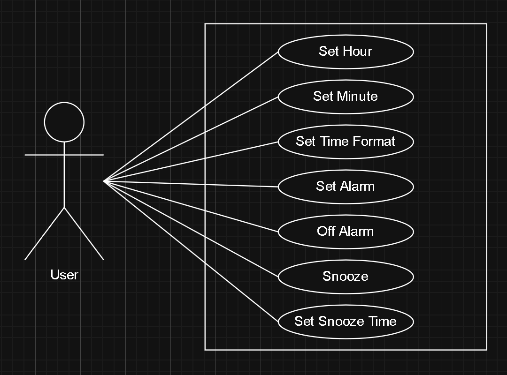

# Question 1

1. Stick Figure/Actor (Home Owner)
   - The user of the system. They are not part of the system, but they are the one interacting and using the system.
   - In this case, it is the home owner. 

2. System Boundary (Home Heating)
   - Everything within the rectangle is part of the system.
   - Everything outside the rectangle is an external entity interacting with the system.
   - In this case, it defines the home heating system.

3. Use Cases (Power Up, Power Down, Change Temp.)
   - A function within the system, that the system provides to the actor.
   - In this case, Power Up allows the user to switch the system on; Power Down allows the user to switch the system off; Change Temp. allows the user
     to alter the temperature of the heater.

4. Associations/Lines
   - This shows the interaction between the actor and a use case.
   - When connected, the actor can use or activate the function.
   - In this case, the home owner can change the temperature of the heater and switch it on and off.
  
# Question 2

The use-case model defines the functions/use cases of a system, as well as how the user/actor is expected to interact with each use case. 

# Question 3

1. \<<include\>>
   - The use-case diagram incorporates the behaviour of another use-case diagram.

2. \<<extend\>>
   - An extended use-case diagram adds optional or conditional behaviour to a base use-case diagram.
  
# Question 4

